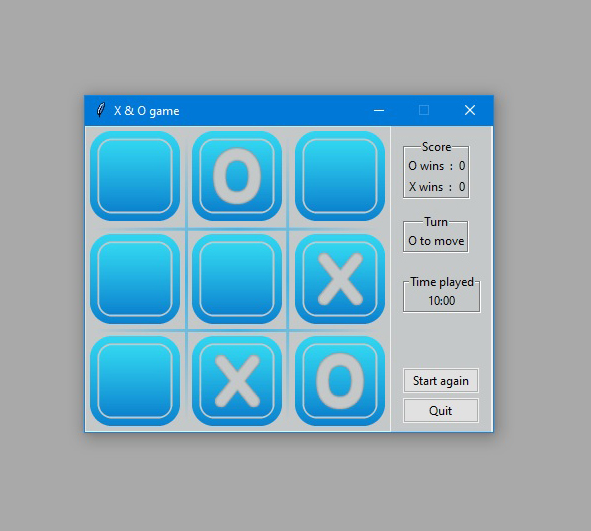
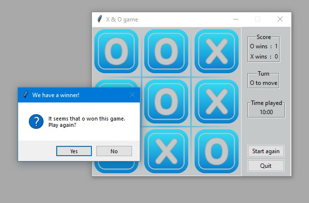

# Python-Tk-XO-Game
<p float="left">


</p>

## Description

XO Game using Tkinter package and some self designed buttons and background image.

## Installation

Use the pip install command and install Tkinter
(as an option create an Virtual Environment)

```bash
pip install tk
(as an option create an Virtual Environment if you want)
```

## Usage
```python
 when game loads, it chooses random player to start

# click on any container to mark it with O or X

# when a player wins, score is updated and a pop-up window appears for QUITTING  or to RELOAD a new game

# click on "Start again" button to reload a new game

```

